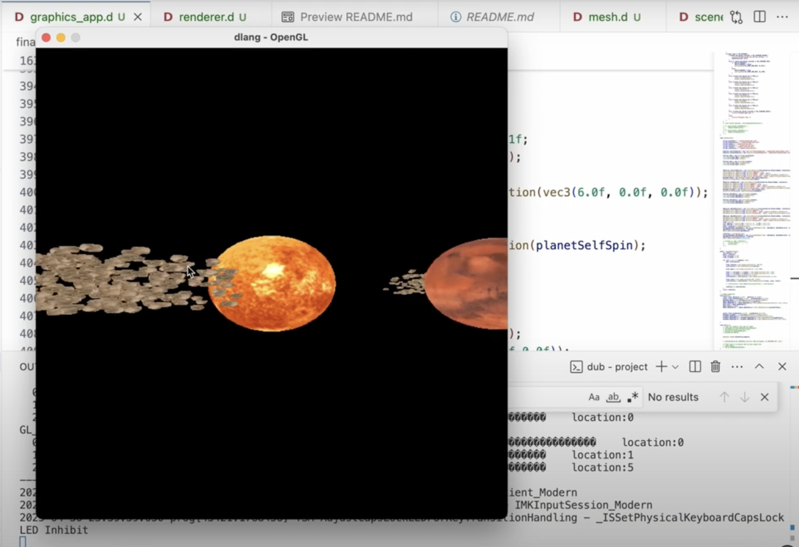

# L4-and-L5-Lagrange-Points

This is a Computer Graphics class project. I used Dlang, OpenGL, and SDL to create a visualizeation of L4 and L5 Lagrange Points.

Here is the Youtube video descirbing my project: 

https://www.youtube.com/watch?v=NGjE0tJIJR4

This project made use of the following sources:
1. https://learnopengl.com/Advanced-OpenGL/Instancing
2. https://commons.wikimedia.org/wiki/File:Solarsystemscope_texture_2k_mars.jpg
3. https://commons.wikimedia.org/wiki/File:Solarsystemscope_texture_2k_sun.jpg
